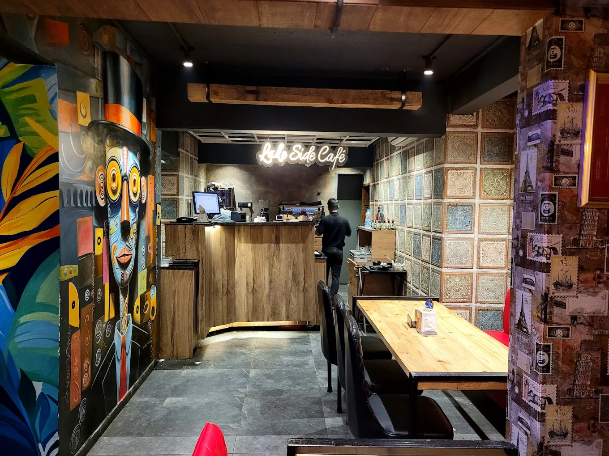

# Lake Side Café

> Experience premium dining at Lake Side Café. Fresh ingredients, beautiful ambiance, and breathtaking lake views.



**Live Demo**: [Lake Side Café](https://lake-side-cafe.vercel.app)

## Features
- **Premium UI/UX**: Warm café color palette, smooth scrolling, modern typography.
- **3D Menu Experience**: View your food in 3D using `<model-viewer>`.
- **Seamless Cart & Checkout**: Add to cart, view total, and order via WhatsApp.
- **Responsive Design**: Mobile-first architecture using Tailwind CSS.

## Tech Stack
- HTML5, CSS3, Vanilla JavaScript
- Tailwind CSS (via CDN)
- FontAwesome Icons
- Google Fonts (Inter, Playfair Display)

## Setup
1. Clone the repository.
2. Open `index.html` in your browser.
3. No build steps required.

## Folder Structure
```
/
├── assets/         # Images and visual assets
├── docs/           # Documentation and reports
├── src/            # Source scripts
├── public/         # Public static assets
├── index.html      # Landing Page
├── menu.html       # Menu & 3D Viewer
├── cart.html       # Cart & Checkout
├── auth.html       # Authentication
└── styles.css      # Custom Styles
```

## License
MIT License
